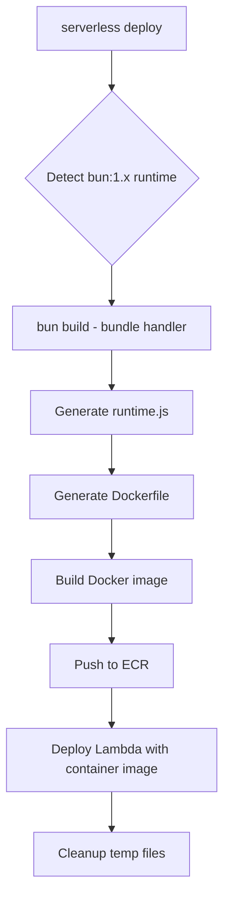
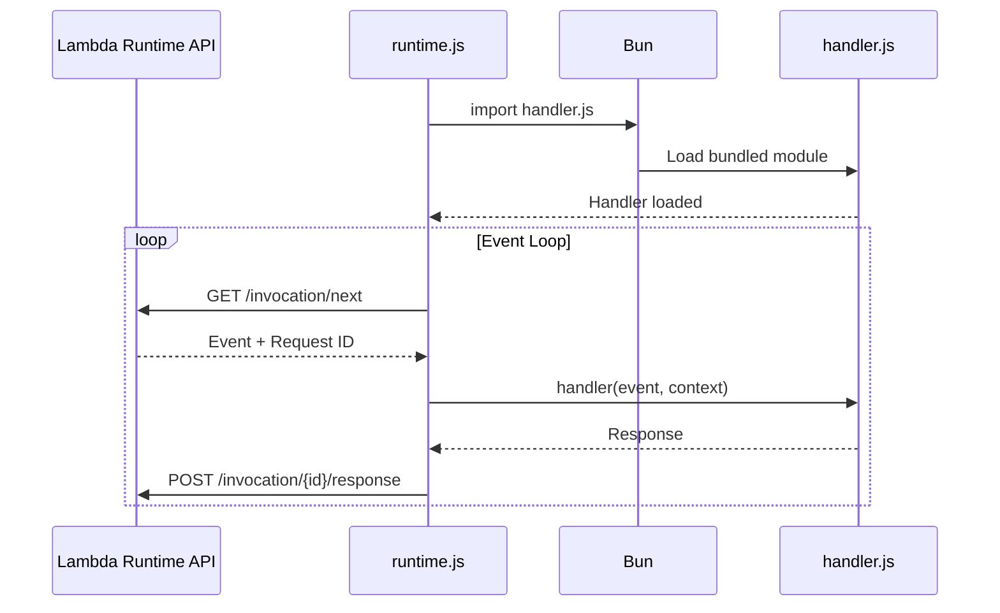

# Serverless Bun Plugin

A Serverless Framework plugin that enables Bun runtime for AWS Lambda functions using Docker container images.

## Requirements

- Bun installed locally (for bundling)
- Docker installed and running
- Serverless Framework v3+
- AWS account with ECR access

## Installation

```bash
npm install serverless-bun-plugin
```

or using yarn

```bash
yarn add serverless-bun-plugin
```

or using pnpm

```bash
pnpm add serverless-bun-plugin
```

or using bun

```bash
bun add serverless-bun-plugin
```

## Usage

```yaml
plugins:
  - serverless-bun-plugin
```

## Configuration

```yaml
custom:
  bun:
    version: 1.3.4    # Bun version for Docker image (default: latest)
    minify: true      # Minify bundle output (default: true)
    sourcemap: none   # Sourcemap generation: none, inline, external (default: none)
    target: bun       # Build target: bun, node, browser (default: bun)
```

### Architecture

The plugin supports both `x86_64` (default) and `arm64` architectures:

```yaml
provider:
  architecture: arm64

functions:
  my-function:
    handler: src/handler.default
    runtime: bun:1.x
    architecture: arm64
```

## Example

See [example](./example) for more details.

### Function-level runtime

```yaml
functions:
  my-queue:
    handler: my-queue/handler.default
    runtime: bun:1.x
    memorySize: 256
    timeout: 30
```

### Provider-level runtime

```yaml
provider:
  name: aws
  runtime: bun:1.x

functions:
  my-queue:
    handler: my-queue/handler.default
    memorySize: 256
    timeout: 30
```

## Local Invoke

The plugin supports local invocation using Bun:

```bash
serverless invoke local -f myFunction
```

With event data:

```bash
serverless invoke local -f myFunction -d '{"key": "value"}'
```

With event file:

```bash
serverless invoke local -f myFunction -p event.json
```

## How It Works

This plugin uses **Bun's built-in bundler** to compile your TypeScript code into a single optimized JavaScript file before deployment. This approach provides:

- Full TypeScript support including `tsconfig.json` paths and aliases
- Tree-shaking and dead code elimination
- Single file output (no node_modules in the container)
- Minification for smaller bundle size
- Faster cold starts (pre-bundled code)

### Deployment Flow



### Lambda Execution Flow



### Process Steps

1. The plugin intercepts functions with `bun:1.x` runtime
2. Runs `bun build` to bundle the handler into a single `handler.js` file
3. Generates a custom Lambda runtime (`runtime.js`) that handles the Lambda Runtime API
4. Generates a minimal Dockerfile using `oven/bun` and `public.ecr.aws/lambda/provided:al2023`
5. Configures ECR image deployment automatically
6. Cleans up temporary files after packaging

## License

MIT License

Copyright (c) 2025 Thadeu

Permission is hereby granted, free of charge, to any person obtaining a copy
of this software and associated documentation files (the "Software"), to deal
in the Software without restriction, including without limitation the rights
to use, copy, modify, merge, publish, distribute, sublicense, and/or sell
copies of the Software, and to permit persons to whom the Software is
furnished to do so, subject to the following conditions:

The above copyright notice and this permission notice shall be included in all
copies or substantial portions of the Software.